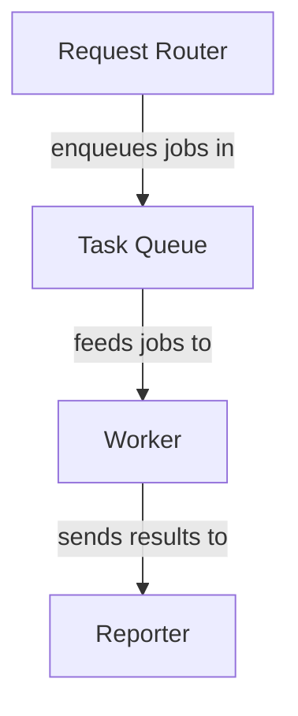

# Templates

Fill the `{{placeholders}}`. Keep prose beginner-friendly and analogy-led.

---

## Chapter template — `NN_<name>.md`

```markdown
# Chapter {{n}}: {{Abstraction Name}}

{{One-line tag of what this is, in plain words.}}

## Why this exists

{{The problem it solves, framed for a newcomer. Lead with an analogy —
"Imagine a … that needs to …". Explain the pain there would be without it.}}

## The big idea

{{Plain-language explanation of the concept. One analogy, carried through.
No jargon without a definition.}}

## How it works in this codebase

It lives in:
- `{{relative/path/one.ext}}`
- `{{relative/path/two.ext}}`

Here's the heart of it:

```{{lang}}
{{short snippet — a few key lines, not the whole file}}
```

{{Walk through the snippet: what each important line does and why. Tie it back
to the analogy.}}

## How it connects

{{Name the related abstractions and link their chapters, e.g. it receives work
from [the Task Queue](02_task_queue.md) and hands results to
[the Reporter](05_reporter.md). Reflect the relationships from
relationships.json.}}

## Recap

{{2–3 sentences. What the reader now understands, and a one-line bridge to the
next chapter.}}
```

---

## Index template — `index.md`

```markdown
# {{Project Name}} — Tutorial

{{The one-paragraph project summary from relationships.json.}}

## Architecture at a glance

```mermaid
flowchart TD
{{nodes and edges — see Mermaid rules below}}
```

## Chapters

{{Ordered list following order.json:}}
1. [{{Abstraction Name}}]({{01_name.md}}) — {{one-line teaser}}
2. [{{Abstraction Name}}]({{02_name.md}}) — {{one-line teaser}}
...

---
_Generated read-only from the source. No code left this machine._
```

---

## Mermaid generation rules (`flowchart TD`)

Build node IDs and labels from the abstractions list; build edges from
`relationships`.

- **Node ID:** `A{{index}}` (e.g. `A0`, `A1`) — safe, stable, never the label.
- **Node declaration:** `A{{index}}["{{sanitised name}}"]`
- **Edge:** `A{{from}} -->|"{{sanitised label}}"| A{{to}}`

### Sanitisation rule (MUST apply to every label)

Mermaid breaks on certain characters. For every node label and edge label:

1. Replace newlines / tabs with a single space; collapse repeated spaces.
2. Remove double quotes `"` and backticks `` ` `` (or replace with `'`).
3. Replace parentheses `()`, square `[]`, curly `{}` brackets with spaces.
4. Replace pipe `|`, angle brackets `<>`, `#`, `;` with spaces.
5. Trim, and cap length (~40 chars) so the diagram stays readable.
6. Always wrap the final label in double quotes inside the brackets:
   `A0["Request Router"]` and `-->|"sends jobs to"|`.

If after sanitisation a label is empty, fall back to the node ID.

### Example output



Validate the block parses before writing `index.md`. If a render check isn't
available, at minimum confirm: every `A<n>` in an edge has a declaration, no raw
unescaped quote/paren/pipe survives in any label, and each line is well-formed.
